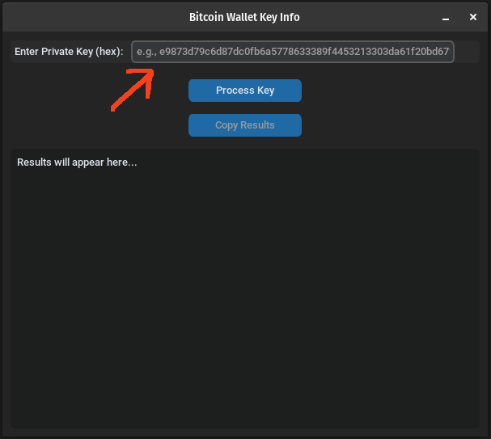

# keyHub
Hub for my key tracking and management 

## Installations

## Install Python
- Load python on [Linux](./python311.md)
- Load python [environment](./loadPythonEnv.md)
## Install CustomTkinter and blockchain
    pip3 install customtkinter base58 bitcoinlib
---
**<if necessary> Update out of date installation of customtkinter:** pip install customtkinter --upgrade

## Alternative Install: using Requirements file 
    pip install -r requirements.txt 

 
 
 

<h3 align="center">Bitcoin Private Key Detials App</h3>
    

    <picture>
        <source media="(prefers-color-scheme: dark)" srcset="./images/view_privKey_00.png">
        
    </picture>
    

</h3>

Donations

 ##### QR CODE create by: [myself](https://github.com/Juniorduc44/qrGenGui)
 <h3 align="center">BITCOIN</h3>
 <h3 align="center">bc1qfm8dhsfp64z0tm9yrgl8sq60d5q89pu4y8z2j9</h3>
     

     <picture>
         <source media="(prefers-color-scheme: dark)" srcset="./images/qrDonation_keyHub.png">
         
     </picture>
     

 </h3>

 
